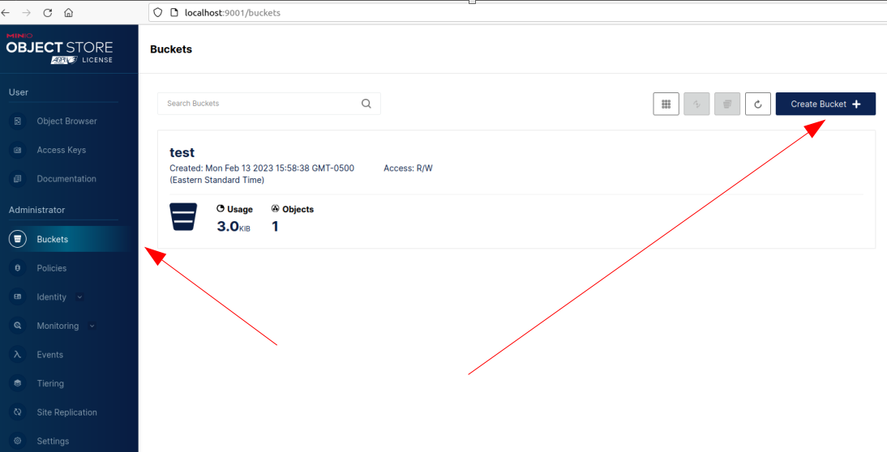

# Project Name: Backup Vault in Minio

## Project Goal
In this lab, you will deploy a helm chart with a cronjob to backup vault periodically into the Minio storage

## Table of Contents
1. [Prerequisites](#prerequisites)
2. [Project Steps](#project_steps)
3. [Post Project](#post_project)
4. [Troubleshooting](#troubleshooting)
5. [Reference](#reference)

## <a name="prerequisites">Prerequisites</a>
- Ubuntu 20.04 OS (Minimum 2 core CPU/8GB RAM/30GB Disk)
- Docker(see installation guide [here](https://docs.docker.com/get-docker/))
- Docker Compose(see installation guide [here](https://docs.docker.com/compose/install/))
- Minikube (see installation guide [here](https://minikube.sigs.k8s.io/docs/start/))
- Helm (see installation guide [here](https://helm.sh/docs/intro/install/)


## <a name="project_steps">Project Steps</a>

### 1. Start Minikube
You can install the **Minikube** by following the instruction in the [Minikube official website](https://minikube.sigs.k8s.io/docs/start/). Once it is installed, start the minikube by running below command:
```
minikube start
minikube status
```
Once the Minikube starts, you can download the **kubectl** from [k8s official website](https://kubernetes.io/docs/tasks/tools/)
```
minikube kubectl
alias k="kubectl"
```
Then, when you run the command `kubectl get node` or `k get node`, you should see below output:
```
NAME       STATUS   ROLES           AGE     VERSION
minikube   Ready    control-plane   4m37s   v1.25.3
```
### 2. Enable Minikube Dashboard
You can also enable your **Minikube dashboard** by running below command:
```
minikube dashboard
```
You should see a Kuberentes Dashboard page pop out in your browser immediately. You can explore all Minikube resources in this UI website.

### 3. Install Helm v3.x
Run the following commands to install **Helm v3.x**:
> ref: https://helm.sh/docs/intro/install/
```
curl https://raw.githubusercontent.com/kubernetes/helm/master/scripts/get-helm-3 > get_helm.sh
chmod 700 get_helm.sh
./get_helm.sh
```

### 4. Add Helm Repo
Once Helm is set up properly, **add** the **repo** as follows:
```
helm repo add minio https://charts.min.io/
```

### 5. Create a namespace
Create a `minio` namespace
```
kubectl create ns minio
```

### 6. Install Minio Helm Chart
Since we are using Minikube cluster which has only 1 node, we just deploy the Minio in a test mode.
```
helm install --set resources.requests.memory=512Mi --set replicas=1 --set mode=standalone --set rootUser=rootuser,rootPassword=Test1234! --generate-name minio/minio
```

### 7. Create a Bucket in the Minio Console
In order to access the Minio console, you need to port forward it to your local
```
kubectl port-forward svc/$(kubectl get svc|grep console|awk '{print $1}') 9001:9001
```
Open your browser and go to this URL [http://localhost:9001](http://localhost:9001), and login with the username/password as `rootUser`/`rootPassword` setup above. Go to *Buckets* section in the left lane and click *Create Bucket* with a name `test`, with all other setting as default.


### 8. 


## <a name="post_project">Post Project</a>

## <a name="troubleshooting">Troubleshooting</a>

## <a name="reference">Reference</a>
[Minio Helm Deployment](https://github.com/minio/minio/tree/master/helm/minio)
